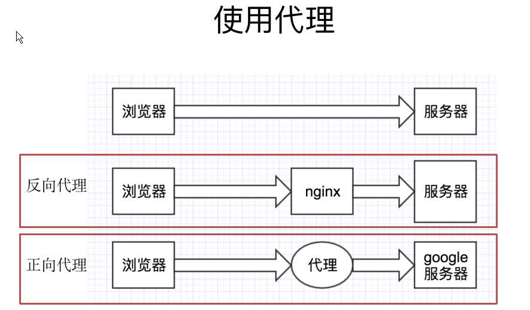

# 爬虫
## python原理和数据抓取
### 通用爬虫和聚焦爬虫
#### 通用爬虫
通用网络爬虫 是 捜索引擎抓取系统（Baidu、Google、Yahoo等）的重要组成部分。主要目的是将互联网上的网页下载到本地，形成一个互联网内容的镜像备份。
#### 聚焦爬虫
聚焦爬虫，是"面向特定主题需求"的一种网络爬虫程序，它与通用搜索引擎爬虫的区别在于： 聚焦爬虫在实施网页抓取时会对内容进行处理筛选，尽量保证只抓取与需求相关的网页信息。
### str和bytes区别
* bytes对象只负责以二进制字节序列的形式记录所需记录的对象，至于该对象到底表示什么（比如到底是什么字符）则由相应的编码格式解码所决定
* python2 VS python3
    * bytes是Python 3中特有的，Python 2 里不区分bytes和str。
    * 互联网使用二进制传输，python3需要将str转换成bytes进行传输，而在接收中通过decode()解码成我们需要的编码进行处理数据
* bytes VS bytearray
    * bytearray和bytes不一样的地方在于，bytearray是可变的。

### Requests 使用
[跳转脚本](request_test.py)
> requests 的底层实现其实就是 urllib   
开源地址：https://github.com/kennethreitz/requests   
中文文档 API： http://docs.python-requests.org/zh_CN/latest/index.html

* 安装：pip install requests   
* 优点
    * 底层实现urlib
    * python2/python3通用
    * 简单易用
    * 自动解压（gzip等）压缩等网页
* 使用：
    * response = requests.get(url)
    * 常用方法：
        * response.text
        * response.content
        * response.status_code
        * response.request.headers
        * response.headers
    * 返回数据的编码和解码
        ```
        response.text
        类型：str
        解码类型： 根据HTTP 头部对响应的编码作出有根据的推测，推测的文本编码
        如何修改编码方式：response.encoding=”gbk”
        
        response.content
        类型：bytes
        解码类型： 没有指定
        如何修改编码方式：response.content.deocde(“utf8”)
        ```
* 代理
    * 目的：模拟多个客户端请求+ 防止真是IP泄漏
    
    * 常用代理网站：
    * http://www.66ip.cn/pt.html
    * https://www.jianshu.com/p/93fd64a2747b
* 代理（proxies参数）
```
import requests

# 根据协议类型，选择不同的代理
proxies = {
  "http": "http://12.34.56.79:9527",
  "https": "http://12.34.56.79:9527",
}

response = requests.get("http://www.baidu.com", proxies = proxies)
print response.text
   
也可以通过本地环境变量 HTTP_PROXY 和 HTTPS_PROXY 来配置代理：

export HTTP_PROXY="http://12.34.56.79:9527"
export HTTPS_PROXY="https://12.34.56.79:9527"

```
* 私密代理验证（特定格式） 和 Web客户端验证（auth 参数）
```
import requests

# 如果代理需要使用HTTP Basic Auth，可以使用下面这种格式：
proxy = { "http": "mr_mao_hacker:sffqry9r@61.158.163.130:16816" }

response = requests.get("http://www.baidu.com", proxies = proxy)

print (response.text)
```
* web客户端验证
```
import requests

auth=('test', '123456')

response = requests.get('http://192.168.199.107', auth = auth)

print (response.text)
```
* Cookies
    * 如果一个响应中包含了cookie，那么我们可以利用 cookies参数拿到：
    ``` 
    import requests
    response = requests.get("http://www.baidu.com/")
    # 7\. 返回CookieJar对象:
    cookiejar = response.cookies
    # 8\. 将CookieJar转为字典：
    cookiedict = requests.utils.dict_from_cookiejar(cookiejar)
    print (cookiejar)
    print (cookiedict)
    ```
> cookie数据存放在客户的浏览器上，session数据放在服务器上。   
cookie不是很安全，别人可以分析存放在本地的cookie并进行cookie欺骗。
session会在一定时间内保存在服务器上。当访问增多，会比较占用你服务器的性能。
单个cookie保存的数据不能超过4K，很多浏览器都限制一个站点最多保存20个cookie。
* session
    * 在 requests 里，session对象是一个非常常用的对象，这个对象代表一次用户会话：从客户端浏览器连接服务器开始，到客户端浏览器与服务器断开。
    * 会话能让我们在跨请求时候保持某些参数，比如在同一个 Session 实例发出的所有请求之间保持 cookie 。
    ```
    实现人人网登录
    import requests
        # 1\. 创建session对象，可以保存Cookie值
        ssion = requests.session()
        # 2\. 处理 headers
        headers = {"User-Agent": "Mozilla/5.0 (Windows NT 10.0; Win64; x64) AppleWebKit/537.36 (KHTML, like Gecko) Chrome/54.0.2840.99 Safari/537.36"}
        # 3\. 需要登录的用户名和密码
        data = {"email":"mr_mao_hacker@163.com", "password":"alarmchime"}  
        # 4\. 发送附带用户名和密码的请求，并获取登录后的Cookie值，保存在ssion里
        ssion.post("http://www.renren.com/PLogin.do", data = data)
        # 5\. ssion包含用户登录后的Cookie值，可以直接访问那些登录后才可以访问的页面
        response = ssion.get("http://www.renren.com/410043129/profile")
        # 6\. 打印响应内容
        print (response.text)
    ```
* 处理HTTPS请求 SSL证书验证
    * Requests也可以为HTTPS请求验证SSL证书：
    * 如果我们想跳过 12306 的证书验证，把 verify 设置为 False 就可以正常请求了。
        * r = requests.get("https://www.12306.cn/mormhweb/", verify = False)
## 非结构化数据和结构化数据提取
### 分类
* 非结构化的数据：文本、电话号码、邮箱地址、html等
    * 处理方法：正则表达式、xpath
* 结构化数据：json，xml等
    * 处理方法：转化为python数据类型
### 正则表达式
* 定义：正则表达式，又称规则表达式，通常被用来检索、替换那些符合某个模式(规则)的文本。

* 【注】有一点需要特别注意的是，正则表达式使用 对特殊字符进行转义，所以如果我们要使用原始字符串，只需加一个 r 前缀，示例：r'chuanzhiboke\t\.\tpython'
* 使用步骤：
    * 使用 compile() 函数将正则表达式的字符串形式编译为一个 Pattern 对象
    * 通过 Pattern 对象提供的一系列方法对文本进行匹配查找，获得匹配结果，一个 Match 对象。
    * 最后使用 Match 对象提供的属性和方法获得信息，根据需要进行其他的操作
* compile 函数
    * compile 函数用于编译正则表达式，生成一个 Pattern 对象，它的一般使用形式如下：
    ```python
    import re
    # 将正则表达式编译成 Pattern 对象
    pattern = re.compile(r'\d+')
    ```
* Pattern 对象
    * match 方法：从起始位置开始查找，一次匹配(如果起始位置不匹配直接返回None) 
        * match(string[, pos[, endpos]])
     ```python
        >>> import re
        >>> pattern = re.compile(r'\d+')  # 用于匹配至少一个数字
        
        >>> m = pattern.match('one12twothree34four')  # 查找头部，没有匹配
        >>> print (m)
        None
        
        >>> m = pattern.match('one12twothree34four', 2, 10) # 从'e'的位置开始匹配，没有匹配
        >>> print (m)
        None
        
        >>> m = pattern.match('one12twothree34four', 3, 10) # 从'1'的位置开始匹配，正好匹配
        >>> print (m)                                         # 返回一个 Match 对象
        <_sre.SRE_Match object at 0x10a42aac0>
        
        >>> m.group(0)   # 可省略 0
        '12'
        >>> m.start(0)   # 可省略 0
        3
        >>> m.end(0)     # 可省略 0
        5
        >>> m.span(0)    # 可省略 0
        (3, 5)
    ```  
    * search 方法：从任何位置开始查找，一次匹配
        * search 方法用于查找字符串的任何位置，它也是一次匹配，只要找到了一个匹配的结果就返回，而不是查找所有匹配的结果，它的一般使用形式如下：
        * search(string[, pos[, endpos]])
        ```python
            >>> import re
            >>> pattern = re.compile('\d+')
            >>> m = pattern.search('one12twothree34four')  # 这里如果使用 match 方法则不匹配
            >>> m
            <_sre.SRE_Match object at 0x10cc03ac0>
            >>> m.group()
            '12'
            >>> m = pattern.search('one12twothree34four', 10, 30)  # 指定字符串区间
            >>> m
            <_sre.SRE_Match object at 0x10cc03b28>
            >>> m.group()
            '34'
            >>> m.span()
            (13, 15)
        ```
    * findall 方法：全部匹配，返回列表   
        * 上面的 match 和 search 方法都是一次匹配，只要找到了一个匹配的结果就返回。然而，在大多数时候，我们需要搜索整个字符串，获得所有匹配的结果。
        * findall(string[, pos[, endpos]])
        ```python
            # re_test.py
            
            import re
            
            #re模块提供一个方法叫compile模块，提供我们输入一个匹配的规则
            #然后返回一个pattern实例，我们根据这个规则去匹配字符串
            pattern = re.compile(r'\d+\.\d*')
            
            #通过partten.findall()方法就能够全部匹配到我们得到的字符串
            result = pattern.findall("123.141593, 'bigcat', 232312, 3.15")
            
            #findall 以 列表形式 返回全部能匹配的子串给result
            for item in result:
                print (item)
            运行结果：
            
            123.141593
            3.15
        ```
    * finditer 方法：全部匹配，返回迭代器   
    * split 方法：分割字符串，返回列表   
    ```python
        import re
        p = re.compile(r'[\s\,\;]+')
        print (p.split('a,b;; c   d'))
        执行结果：
        ['a', 'b', 'c', 'd']  
    ```
    * sub 方法：替换   
    ```python
    import re
    p = re.compile(r'(\w+) (\w+)') # \w = [A-Za-z0-9]
    s = 'hello 123, hello 456'
    
    print (p.sub(r'hello world', s))  # 使用 'hello world' 替换 'hello 123' 和 'hello 456'
    print (p.sub(r'\2 \1', s))        # 引用分组
    
    def func(m):
        print(m)
        return 'hi' + ' ' + m.group(2) #group(0) 表示本身，group(1)表示hello，group(2) 表示后面的数字
    
    print (p.sub(func, s))  #多次sub，每次sub的结果传递给func
    print (p.sub(func, s, 1))         # 最多替换一次
    ```
    * 匹配中文
    ```python
    import re
    title = '你好，hello，世界'
    pattern = re.compile(r'[\u4e00-\u9fa5]+')
    result = pattern.findall(title)
    
    print (result)
    >>> ['你好', '世界']
    ```
* Match 对象
    * group([group1, ...]) 方法用于获得一个或多个分组匹配的字符串，当要获得整个匹配的子串时，可直接使用 group() 或 group(0)；
    * start([group]) 方法用于获取分组匹配的子串在整个字符串中的起始位置（子串第一个字符的索引），参数默认值为 0；
    * end([group]) 方法用于获取分组匹配的子串在整个字符串中的结束位置（子串最后一个字符的索引+1），参数默认值为 0；
    * span([group]) 方法返回 (start(group), end(group))。
  
```python
>>> import re
>>> pattern = re.compile(r'([a-z]+) ([a-z]+)', re.I)  # re.I 表示忽略大小写
>>> m = pattern.match('Hello World Wide Web')

>>> print (m)     # 匹配成功，返回一个 Match 对象
<_sre.SRE_Match object at 0x10bea83e8>

>>> m.group(0)  # 返回匹配成功的整个子串
'Hello World'

>>> m.span(0)   # 返回匹配成功的整个子串的索引
(0, 11)

>>> m.group(1)  # 返回第一个分组匹配成功的子串
'Hello'

>>> m.span(1)   # 返回第一个分组匹配成功的子串的索引
(0, 5)

>>> m.group(2)  # 返回第二个分组匹配成功的子串
'World'

>>> m.span(2)   # 返回第二个分组匹配成功的子串
(6, 11)

>>> m.groups()  # 等价于 (m.group(1), m.group(2), ...)
('Hello', 'World')

>>> m.group(3)   # 不存在第三个分组
Traceback (most recent call last):
  File "<stdin>", line 1, in <module>
IndexError: no such group

```
* 【注意：贪婪模式与非贪婪模式】
```python
示例一 ： 源字符串：abbbc
使用贪婪的数量词的正则表达式 ab* ，匹配结果： abbb。

* 决定了尽可能多匹配 b，所以a后面所有的 b 都出现了。

使用非贪婪的数量词的正则表达式ab*?，匹配结果： a。

即使前面有 *，但是 ? 决定了尽可能少匹配 b，所以没有 b。
```
```python
示例二 ： 源字符串：aa<div>test1</div>bb<div>test2</div>cc
使用贪婪的数量词的正则表达式：<div>.*</div>

匹配结果：<div>test1</div>bb<div>test2</div>

这里采用的是贪婪模式。在匹配到第一个"</div>"时已经可以使整个表达式匹配成功，但是由于采用的是贪婪模式，所以仍然要向右尝试匹配，查看是否还有更长的可以成功匹配的子串。匹配到第二个"</div>"后，向右再没有可以成功匹配的子串，匹配结束，匹配结果为"<div>test1</div>bb<div>test2</div>"

使用非贪婪的数量词的正则表达式：<div>.*?</div>

匹配结果：<div>test1</div>

正则表达式二采用的是非贪婪模式，在匹配到第一个"</div>"时使整个表达式匹配成功，由于采用的是非贪婪模式，所以结束匹配，不再向右尝试，匹配结果为"<div>test1</div>"。

```
[正则表达式验证]([http://tool.oschina.net/regex/])

* 实例脚本
[跳转脚本](duanzi_spider.py)
### Xpath与lxml类库
* 什么是XPath？
    * XPath (XML Path Language) 是一门在 XML 文档中查找信息的语言，可用来在 XML 文档中对元素和属性进行遍历。
```
选取节点
XPath 使用路径表达式来选取 XML 文档中的节点或者节点集。这些路径表达式和我们在常规的电脑文件系统中看到的表达式非常相似。

下面列出了最常用的路径表达式：

表达式	描述
nodename	选取此节点的所有子节点。
/	从根节点选取。
//	从匹配选择的当前节点选择文档中的节点，而不考虑它们的位置。
.	选取当前节点。
..	选取当前节点的父节点。
@	选取属性。
-------------------
bookstore	选取 bookstore 元素的所有子节点。
/bookstore	选取根元素 bookstore。注释：假如路径起始于正斜杠( / )，则此路径始终代表到某元素的绝对路径！
bookstore/book	选取属于 bookstore 的子元素的所有 book 元素。
//book	选取所有 book 子元素，而不管它们在文档中的位置。
bookstore//book	选择属于 bookstore 元素的后代的所有 book 元素，而不管它们位于 bookstore 之下的什么位置。
//@lang	选取名为 lang 的所有属性。
-------------------
谓语用来查找某个特定的节点或者包含某个指定的值的节点，被嵌在方括号中。

在下面的表格中，我们列出了带有谓语的一些路径表达式，以及表达式的结果：

路径表达式	结果
/bookstore/book[1]	选取属于 bookstore 子元素的第一个 book 元素。
/bookstore/book[last()]	选取属于 bookstore 子元素的最后一个 book 元素。
/bookstore/book[last()-1]	选取属于 bookstore 子元素的倒数第二个 book 元素。
/bookstore/book[position()<3]	选取最前面的两个属于 bookstore 元素的子元素的 book 元素。
//title[@lang]	选取所有拥有名为 lang 的属性的 title 元素。
//title[@lang=’eng’]	选取所有 title 元素，且这些元素拥有值为 eng 的 lang 属性。
/bookstore/book[price>35.00]	选取 bookstore 元素的所有 book 元素，且其中的 price 元素的值须大于 35.00。
/bookstore/book[price>35.00]/title	选取 bookstore 元素中的 book 元素的所有 title 元素，且其中的 price 元素的值须大于 35.00。
-------------------
选取未知节点
XPath 通配符可用来选取未知的 XML 元素。

通配符	描述
*	匹配任何元素节点。
@*	匹配任何属性节点。
node()	匹配任何类型的节点。
在下面的表格中，我们列出了一些路径表达式，以及这些表达式的结果：

路径表达式	结果
/bookstore/*	选取 bookstore 元素的所有子元素。
//*	选取文档中的所有元素。
html/node()/meta/@*	选择html下面任意节点下的meta节点的所有属性
//title[@*]	选取所有带有属性的 title 元素。
-------------------
选取若干路径
通过在路径表达式中使用“|”运算符，您可以选取若干个路径。

实例

在下面的表格中，我们列出了一些路径表达式，以及这些表达式的结果：

路径表达式	结果
//book/title | //book/price	选取 book 元素的所有 title 和 price 元素。
//title | //price	选取文档中的所有 title 和 price 元素。
/bookstore/book/title | //price	选取属于 bookstore 元素的 book 元素的所有 title 元素，以及文档中所有的 price 元素。
```
* lxml库
> lxml 是 一个HTML/XML的解析器，主要的功能是如何解析和提取 HTML/XML 数据。   
lxml和正则一样，也是用 C 实现的，是一款高性能的 Python HTML/XML 解析器，我们可以利用之前学习的XPath语法，来快速的定位特定元素以及节点信息。   
lxml python 官方文档：http://lxml.de/index.html      
需要安装C语言库，可使用 pip 安装：pip install lxml （或通过wheel方式安装）
    
   * 解析html 
   * 文件读取
   [跳转脚本](lxml_test.py)
* 案例：使用XPath的爬虫
    * 现在我们用XPath来做一个简单的爬虫，我们尝试爬取某个贴吧里的所有帖子，并且将该这个帖子里每个楼层发布的图片下载到本地。[跳转脚本](xpath_spider_tieba.py)
### JSON模块与JsonPath
#### Str与Python转换
json模块提供了四个功能：dumps、dump、loads、load，用于字符串 和 python数据类型间进行转换。
* 1. json.loads()
    * 把Json格式字符串解码转换成Python对象 从json到python的类型转化对照如下：
* 2. json.dumps()
    * 实现python类型转化为json字符串，返回一个str对象 把一个Python对象编码转换成Json字符串
* 3. json.dump()
    * 将Python内置类型序列化为json对象后写入文件
* 4. json.load()
    * 读取文件中json形式的字符串元素 转化成python类型
[跳转脚本](load_jump.py)
#### 
队列+线程+爬虫
[跳转脚本](QiubaiThread.py)
## 动态HTML处理和机器图像识别
[携程技术中心 - 携程酒店研发部研发经理崔广宇 <爬虫与反爬虫> 技术分享](https://segmentfault.com/a/1190000005840672)
### Selenium和PhantomJS
#### Selenium
Selenium是一个Web的自动化测试工具，最初是为网站自动化测试而开发的，类型像我们玩游戏用的按键精灵，可以按指定的命令自动操作，不同是Selenium 可以直接运行在浏览器上，它支持所有主流的浏览器（包括PhantomJS这些无界面的浏览器）。
>可以从 PyPI 网站下载 Selenium库https://pypi.python.org/simple/selenium ，也可以用 第三方管理器 pip用命令安装：sudo pip install selenium
Selenium 官方参考文档：http://selenium-python.readthedocs.io/index.html
#### PhantomJS
PhantomJS 是一个基于Webkit的“无界面”(headless)浏览器，它会把网站加载到内存并执行页面上的 JavaScript，因为不会展示图形界面，所以运行起来比完整的浏览器要高效。
>PhantomJS 是一个功能完善(虽然无界面)的浏览器而非一个 Python 库，所以它不需要像 Python 的其他库一样安装，但我们可以通过Selenium调用PhantomJS来直接使用。
在Ubuntu16.04中可以使用命令安装：sudo apt-get install phantomjs
如果其他系统无法安装，可以从它的官方网站http://phantomjs.org/download.html) 下载。
PhantomJS 官方参考文档：http://phantomjs.org/documentation
####  Selenium 和 PhantomJS 结合在一起，就可以运行一个非常强大的网络爬虫了，这个爬虫可以处理 JavaScrip、Cookie、headers，以及任何我们真实用户需要做的事情。
* 快速入门
[跳转脚本](Selenium_start.py)
* 页面操作
```
find_element_by_id
find_elements_by_name
find_elements_by_xpath
find_elements_by_link_text
find_elements_by_partial_link_text
find_elements_by_tag_name
find_elements_by_class_name
find_elements_by_css_selector
```
* 鼠标动作链
有些时候，我们需要再页面上模拟一些鼠标操作，比如双击、右击、拖拽甚至按住不动等，我们可以通过导入 ActionChains 类来做到：
```python
#导入 ActionChains 类
from selenium.webdriver import ActionChains

# 鼠标移动到 ac 位置
ac = driver.find_element_by_xpath('element')
ActionChains(driver).move_to_element(ac).perform()


# 在 ac 位置单击
ac = driver.find_element_by_xpath("elementA")
ActionChains(driver).move_to_element(ac).click(ac).perform()

# 在 ac 位置双击
ac = driver.find_element_by_xpath("elementB")
ActionChains(driver).move_to_element(ac).double_click(ac).perform()

# 在 ac 位置右击
ac = driver.find_element_by_xpath("elementC")
ActionChains(driver).move_to_element(ac).context_click(ac).perform()

# 在 ac 位置左键单击hold住
ac = driver.find_element_by_xpath('elementF')
ActionChains(driver).move_to_element(ac).click_and_hold(ac).perform()

# 将 ac1 拖拽到 ac2 位置
ac1 = driver.find_element_by_xpath('elementD')
ac2 = driver.find_element_by_xpath('elementE')
ActionChains(driver).drag_and_drop(ac1, ac2).perform()
```
* 填充表单(select)
* 弹窗处理
alert = driver.switch_to_alert()
* 页面切换
driver.switch_to.window("this is window name")   
for handle in driver.window_handles:
    driver.switch_to_window(handle)
* 页面前进和后退
driver.forward()     #前进
driver.back()        # 后退
* Cookies
for cookie in driver.get_cookies():
    print "%s -> %s" % (cookie['name'], cookie['value'])
By name   
driver.delete_cookie("CookieName")   
all   
driver.delete_all_cookies()   
* 页面等待
> 现在的网页越来越多采用了 Ajax 技术，这样程序便不能确定何时某个元素完全加载出来了。如果实际页面等待时间过长导致某个dom元素还没出来，但是你的代码直接使用了这个WebElement，那么就会抛出NullPointer的异常。
   * 显式等待
   ```python
    from selenium import webdriver
    from selenium.webdriver.common.by import By
    # WebDriverWait 库，负责循环等待
    from selenium.webdriver.support.ui import WebDriverWait
    # expected_conditions 类，负责条件出发
    from selenium.webdriver.support import expected_conditions as EC
    
    driver = webdriver.Chrome()
    driver.get("http://www.xxxxx.com/loading")
    try:
        # 页面一直循环，直到 id="myDynamicElement" 出现
        element = WebDriverWait(driver, 10).until(
            EC.presence_of_element_located((By.ID, "myDynamicElement"))
        )
    finally:
        driver.quit()
   ```
   * 隐式等待
   ```python
    from selenium import webdriver
    
    driver = webdriver.Chrome()
    driver.implicitly_wait(10) # seconds
    driver.get("http://www.xxxxx.com/loading")
    myDynamicElement = driver.find_element_by_id("myDynamicElement")
   ```
案例一：网站模拟登录
[跳转脚本](Selenium_start.py)


    
    
    
    
    
    
    
    
    
    
    
    
    
    
    
    
    


    